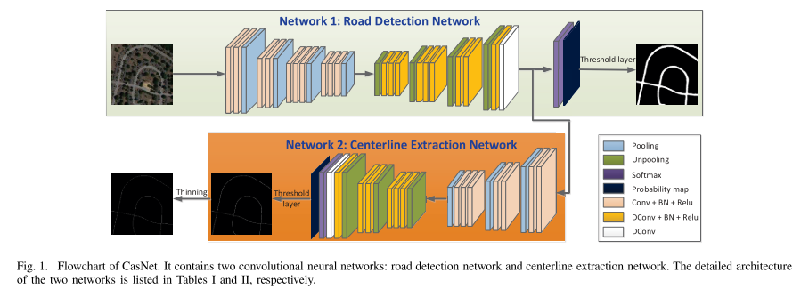

# CasNet - TensorFlow-API
## Semantic segmentation multi-task with TensorFlow API 2.x

The [CasNet](https://ieeexplore.ieee.org/document/7873262) architecture is a cascaded end-to-end convolutional neural network proposed for two simultaneously tasks: road detection and centerline extraction. The overall architecture of that model is shown below.

The model has an input (RGB images) and two outputs (road and centerline). The model was built to use with data loading pipeline of TensorFlow API.
